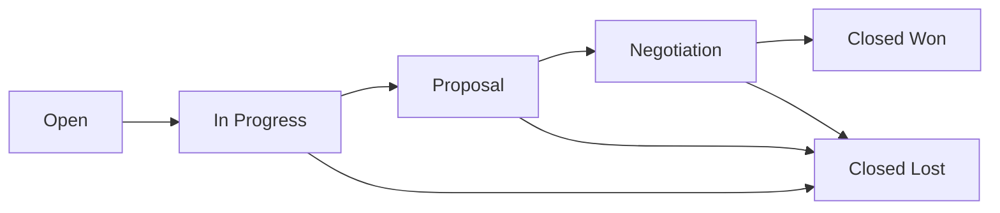

## Overview

The Opportunities API manages sales opportunities, tracking their status, priority levels, and associations with users. Opportunities serve as the central entity connecting users, accounts, and contacts. All endpoints are prefixed with `/api/opportunity`.

**Base Path:** `/api/opportunity`

**Source:** `OpportunityController.java:16`

---

## POST /api/opportunity/createOpportunity

Creates a new sales opportunity in the system with validation.

**Endpoint:** `POST http://localhost:8080/api/opportunity/createOpportunity`

**Source:** `OpportunityController.java:24`

### Request Body

<ParamField path="name" type="string" required>
  Name or title of the sales opportunity
</ParamField>

<ParamField path="priorityLevel" type="integer" required>
  Priority level of the opportunity (typically 1-5, with 1 being highest priority)
</ParamField>

<ParamField path="status" type="string" required>
  Current status of the opportunity
  
  **Common values:** "Open", "In Progress", "Closed Won", "Closed Lost", "Negotiation", "Proposal"
</ParamField>

<ParamField path="user" type="object" required>
  The user/sales representative responsible for this opportunity. Must reference an existing user.
  
  <Expandable title="User Reference">
    <ParamField path="user.userId" type="integer" required>
      ID of the existing user to assign this opportunity to
    </ParamField>
  </Expandable>
</ParamField>

<Warning>
  An opportunity must be assigned to an existing user. The `User_id` field is required and cannot be null.
</Warning>

### Response

<ResponseField name="opportunityID" type="integer">
  Auto-generated unique identifier for the opportunity
</ResponseField>

<ResponseField name="name" type="string">
  Opportunity name
</ResponseField>

<ResponseField name="priorityLevel" type="integer">
  Priority level of the opportunity
</ResponseField>

<ResponseField name="status" type="string">
  Current status
</ResponseField>

<ResponseField name="accounts" type="array">
  List of accounts associated with this opportunity (lazy-loaded)
</ResponseField>

<ResponseField name="contacts" type="array">
  List of contacts associated with this opportunity (lazy-loaded)
</ResponseField>

### Status Codes

- `201 Created` - Opportunity successfully created
- `404 Not Found` - Opportunity creation failed
- `400 Bad Request` - Validation failed or invalid user reference

### Example Request

<CodeGroup>

```bash cURL
curl -X POST http://localhost:8080/api/opportunity/createOpportunity \
  -H "Content-Type: application/json" \
  -d '{
    "name": "Enterprise Software Deal - Acme Corp",
    "priorityLevel": 1,
    "status": "In Progress",
    "user": {
      "userId": 1
    }
  }'
```

```javascript JavaScript
fetch('http://localhost:8080/api/opportunity/createOpportunity', {
  method: 'POST',
  headers: {
    'Content-Type': 'application/json',
  },
  body: JSON.stringify({
    name: 'Enterprise Software Deal - Acme Corp',
    priorityLevel: 1,
    status: 'In Progress',
    user: {
      userId: 1
    }
  })
})
.then(response => response.json())
.then(data => console.log(data));
```

```python Python
import requests

url = 'http://localhost:8080/api/opportunity/createOpportunity'
data = {
    'name': 'Enterprise Software Deal - Acme Corp',
    'priorityLevel': 1,
    'status': 'In Progress',
    'user': {
        'userId': 1
    }
}

response = requests.post(url, json=data)
print(response.json())
```

</CodeGroup>

### Example Response

```json
{
  "opportunityID": 1,
  "name": "Enterprise Software Deal - Acme Corp",
  "priorityLevel": 1,
  "status": "In Progress",
  "accounts": [],
  "contacts": []
}
```

---

## GET /api/opportunity/getOpportunities

Retrieves all sales opportunities from the system.

**Endpoint:** `GET http://localhost:8080/api/opportunity/getOpportunities`

**Source:** `OpportunityController.java:37`

### Response

Returns an array of all opportunity objects.

<ResponseField name="opportunities" type="array">
  Array of opportunity objects. Each opportunity contains:
  
  <Expandable title="Opportunity Object Properties">
    <ResponseField name="opportunityID" type="integer">
      Opportunity's unique identifier
    </ResponseField>
    
    <ResponseField name="name" type="string">
      Opportunity name or title
    </ResponseField>
    
    <ResponseField name="priorityLevel" type="integer">
      Priority level (1-5)
    </ResponseField>
    
    <ResponseField name="status" type="string">
      Current status
    </ResponseField>
    
    <ResponseField name="accounts" type="array">
      List of associated accounts (lazy-loaded)
    </ResponseField>
    
    <ResponseField name="contacts" type="array">
      List of associated contacts (lazy-loaded)
    </ResponseField>
  </Expandable>
</ResponseField>

### Status Codes

- `200 OK` - Opportunities retrieved successfully
- `404 Not Found` - No opportunities found in system

### Example Request

<CodeGroup>

```bash cURL
curl http://localhost:8080/api/opportunity/getOpportunities
```

```javascript JavaScript
fetch('http://localhost:8080/api/opportunity/getOpportunities')
  .then(response => response.json())
  .then(data => console.log(data));
```

```python Python
import requests

url = 'http://localhost:8080/api/opportunity/getOpportunities'
response = requests.get(url)
print(response.json())
```

</CodeGroup>

### Example Response

```json
[
  {
    "opportunityID": 1,
    "name": "Enterprise Software Deal - Acme Corp",
    "priorityLevel": 1,
    "status": "In Progress",
    "accounts": [],
    "contacts": []
  },
  {
    "opportunityID": 2,
    "name": "Cloud Migration - TechStart",
    "priorityLevel": 2,
    "status": "Proposal",
    "accounts": [],
    "contacts": []
  },
  {
    "opportunityID": 3,
    "name": "Annual Renewal - GlobalCo",
    "priorityLevel": 3,
    "status": "Negotiation",
    "accounts": [],
    "contacts": []
  }
]
```

---

## PUT /api/opportunity/updateOpportunity

Updates an existing sales opportunity.

**Endpoint:** `PUT http://localhost:8080/api/opportunity/updateOpportunity`

**Source:** `OpportunityController.java:62`

### Request Body

<ParamField path="opportunityID" type="integer" required>
  The ID of the opportunity to update
</ParamField>

<ParamField path="name" type="string">
  Updated opportunity name
</ParamField>

<ParamField path="priorityLevel" type="integer">
  Updated priority level
</ParamField>

<ParamField path="status" type="string">
  Updated status
</ParamField>

<ParamField path="user" type="object">
  Updated user assignment
  
  <Expandable title="User Reference">
    <ParamField path="user.userId" type="integer">
      ID of the user to reassign to
    </ParamField>
  </Expandable>
</ParamField>

<Info>
  You can update any combination of fields. Only include the fields you want to change along with the `opportunityID`.
</Info>

### Response

<ResponseField name="result" type="boolean">
  - `true` - Opportunity updated successfully
  - `false` - Opportunity update failed
</ResponseField>

### Status Codes

- `200 OK` - Opportunity updated successfully (returns `true`)
- `404 Not Found` - Opportunity not found or update failed (returns `false`)

### Example Request

<CodeGroup>

```bash cURL
curl -X PUT http://localhost:8080/api/opportunity/updateOpportunity \
  -H "Content-Type: application/json" \
  -d '{
    "opportunityID": 1,
    "status": "Closed Won",
    "priorityLevel": 5
  }'
```

```javascript JavaScript
fetch('http://localhost:8080/api/opportunity/updateOpportunity', {
  method: 'PUT',
  headers: {
    'Content-Type': 'application/json',
  },
  body: JSON.stringify({
    opportunityID: 1,
    status: 'Closed Won',
    priorityLevel: 5
  })
})
.then(response => response.json())
.then(data => console.log(data));
```

```python Python
import requests

url = 'http://localhost:8080/api/opportunity/updateOpportunity'
data = {
    'opportunityID': 1,
    'status': 'Closed Won',
    'priorityLevel': 5
}

response = requests.put(url, json=data)
print(response.json())
```

</CodeGroup>

### Example Response

```json
true
```

---

## DELETE /api/opportunity/deleteOpportunity

Deletes a sales opportunity from the system.

**Endpoint:** `DELETE http://localhost:8080/api/opportunity/deleteOpportunity`

**Source:** `OpportunityController.java:50`

### Request Body

<ParamField path="opportunityID" type="integer" required>
  The ID of the opportunity to delete
</ParamField>

<Warning>
  **Cascade Delete:** Deleting an opportunity will also delete all associated accounts and contacts due to cascade settings. This operation cannot be undone.
</Warning>

### Response

<ResponseField name="result" type="boolean">
  - `true` - Opportunity deleted successfully
  - `false` - Opportunity deletion failed
</ResponseField>

### Status Codes

- `200 OK` - Opportunity deleted successfully (returns `true`)
- `404 Not Found` - Opportunity not found or deletion failed (returns `false`)

### Example Request

<CodeGroup>

```bash cURL
curl -X DELETE http://localhost:8080/api/opportunity/deleteOpportunity \
  -H "Content-Type: application/json" \
  -d '{
    "opportunityID": 1
  }'
```

```javascript JavaScript
fetch('http://localhost:8080/api/opportunity/deleteOpportunity', {
  method: 'DELETE',
  headers: {
    'Content-Type': 'application/json',
  },
  body: JSON.stringify({
    opportunityID: 1
  })
})
.then(response => response.json())
.then(data => console.log(data));
```

```python Python
import requests

url = 'http://localhost:8080/api/opportunity/deleteOpportunity'
data = {
    'opportunityID': 1
}

response = requests.delete(url, json=data)
print(response.json())
```

</CodeGroup>

### Example Response

```json
true
```

---

## Data Model

### Opportunity Entity

**Table:** `Opportunity`

**Source:** `Opportunity.java:20`

<ParamField path="opportunityID" type="Integer">
  Primary key, auto-generated
  
  **Annotation:** `@Id @GeneratedValue(strategy = GenerationType.IDENTITY)`
  
  **Source:** `Opportunity.java:23`
</ParamField>

<ParamField path="name" type="String">
  Opportunity name or title
  
  **Source:** `Opportunity.java:25`
</ParamField>

<ParamField path="priorityLevel" type="Integer">
  Priority level for the opportunity
  
  **Typical Range:** 1 (highest) to 5 (lowest)
  
  **Source:** `Opportunity.java:26`
</ParamField>

<ParamField path="status" type="String">
  Current status of the opportunity
  
  **Common Values:** "Open", "In Progress", "Closed Won", "Closed Lost", "Negotiation", "Proposal"
  
  **Source:** `Opportunity.java:27`
</ParamField>

<ParamField path="user" type="User">
  Many-to-one relationship with user (required)
  
  **Annotation:** `@ManyToOne(fetch = FetchType.LAZY, optional = false)`
  
  **Foreign Key:** `User_id` (not nullable)
  
  **Source:** `Opportunity.java:30-32`
</ParamField>

<ParamField path="accounts" type="List<Account>">
  One-to-many relationship with accounts
  
  **Annotation:** `@OneToMany(mappedBy = "opportunity", fetch = FetchType.LAZY, cascade = CascadeType.ALL)`
  
  **Source:** `Opportunity.java:34-35`
</ParamField>

<ParamField path="contacts" type="List<Contact>">
  One-to-many relationship with contacts
  
  **Annotation:** `@OneToMany(mappedBy = "opportunity", fetch = FetchType.LAZY, cascade = CascadeType.ALL)`
  
  **Source:** `Opportunity.java:37-38`
</ParamField>

### Relationships

<Info>
  **Opportunity Relationships:**
  - Each opportunity **must** be assigned to one user (required, not nullable)
  - Each opportunity can have multiple accounts
  - Each opportunity can have multiple contacts
  - Deleting an opportunity will cascade delete all associated accounts and contacts
  - Opportunities serve as the central entity connecting users with their accounts and contacts
</Info>

### Priority Levels

The priority level system helps sales teams focus on the most important opportunities:

| Priority | Description | Use Case |
|----------|-------------|----------|
| 1 | Critical | Large deals, urgent renewals |
| 2 | High | Important prospects, qualified leads |
| 3 | Medium | Standard opportunities |
| 4 | Low | Long-term prospects |
| 5 | Minimal | Cold leads, future opportunities |

### Status Workflow

Typical opportunity lifecycle:



**Common Status Values:**
- **Open** - Initial stage, new opportunity identified
- **In Progress** - Actively working the opportunity
- **Proposal** - Proposal submitted to prospect
- **Negotiation** - Terms and pricing being negotiated
- **Closed Won** - Deal successfully closed
- **Closed Lost** - Opportunity lost to competitor or no decision
