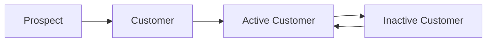

## Overview

Accounts represent companies or organizations in the CRM system. They can be prospects or active customers, and are associated with opportunities and contacts. The Account module tracks essential business information and customer status.

## Data Model

### Account Entity

```java
@Entity
@Table(name = "Account")
public class Account {
    @Id 
    @GeneratedValue(strategy = GenerationType.IDENTITY)
    private Integer accountID;
    
    private String name;
    private String email;
    private String address;
    private long phone;
    private Boolean isCustomer;
    private Boolean isActiveCustomer;
    
    @ManyToOne(fetch = FetchType.LAZY, optional = false)
    @JoinColumn(name = "opportunity_id", nullable = false)
    private Opportunity opportunity;
    
    @OneToMany(mappedBy = "account", fetch = FetchType.LAZY, cascade = CascadeType.ALL)
    private List<Contact> contacts;
}
```

### Field Specifications

<CardGroup cols={2}>
  <Card title="accountID" icon="hashtag">
    **Type:** Integer (Auto-generated)
    
    Primary key, automatically generated
  </Card>
  
  <Card title="name" icon="building">
    **Type:** String
    
    Company or organization name
  </Card>
  
  <Card title="email" icon="envelope">
    **Type:** String
    
    Primary email address for the account
  </Card>
  
  <Card title="address" icon="location-dot">
    **Type:** String
    
    Physical business address
  </Card>
  
  <Card title="phone" icon="phone">
    **Type:** Long
    
    Primary contact phone number
  </Card>
  
  <Card title="isCustomer" icon="check-circle">
    **Type:** Boolean
    
    Indicates if account has purchased/signed up
  </Card>
  
  <Card title="isActiveCustomer" icon="star">
    **Type:** Boolean
    
    Indicates if customer is currently active
  </Card>
</CardGroup>

## Relationships

<Tabs>
  <Tab title="Opportunity">
    **Many-to-One Relationship**
    
    Each account must be associated with an opportunity. This is a required relationship (nullable = false).
    
    ```java
    @ManyToOne(fetch = FetchType.LAZY, optional = false)
    @JoinColumn(name = "opportunity_id", nullable = false)
    private Opportunity opportunity;
    ```
    
    <Note>
      The relationship uses lazy loading for performance optimization. The opportunity is only loaded when explicitly accessed.
    </Note>
  </Tab>
  
  <Tab title="Contacts">
    **One-to-Many Relationship**
    
    An account can have multiple contact records tracking communication history.
    
    ```java
    @OneToMany(mappedBy = "account", fetch = FetchType.LAZY, cascade = CascadeType.ALL)
    private List<Contact> contacts;
    ```
    
    <Note type="info">
      Cascade operations ensure that when an account is deleted, all associated contacts are also removed.
    </Note>
  </Tab>
</Tabs>

## API Endpoints

### Create Account

Register a new account in the system.

```java
@PostMapping("/createAccount")
public ResponseEntity<Account> registerAccount(@Valid @RequestBody Account account)
```

<Accordion title="Request Details">
  **Endpoint:** `POST /api/account/createAccount`
  
  **Request Body:**
  ```json
  {
    "name": "Acme Corporation",
    "email": "contact@acme.com",
    "address": "789 Business Park",
    "phone": 5551234567,
    "isCustomer": false,
    "isActiveCustomer": false,
    "opportunity": {
      "opportunityID": 1
    }
  }
  ```
  
  **Response:** Returns the created account object with generated `accountID`
  
  **Status Codes:**
  - `201 CREATED` - Account successfully created
  - `404 NOT FOUND` - Creation failed
  
  <Note type="warning">
    An account must be associated with an existing opportunity. The opportunity ID is required.
  </Note>
</Accordion>

### Get All Accounts

Retrieve all accounts in the system.

```java
@GetMapping("/getAccounts")
public ResponseEntity<List<Account>> returnsAccounts()
```

<Accordion title="Request Details">
  **Endpoint:** `GET /api/account/getAccounts`
  
  **Response:** Returns array of all account objects
  ```json
  [
    {
      "accountID": 1,
      "name": "Acme Corporation",
      "email": "contact@acme.com",
      "address": "789 Business Park",
      "phone": 5551234567,
      "isCustomer": true,
      "isActiveCustomer": true
    }
  ]
  ```
  
  **Status Codes:**
  - `200 OK` - Accounts retrieved successfully
  - `404 NOT FOUND` - No accounts found
</Accordion>

## Account Lifecycle

Accounts typically follow this lifecycle in the CRM:



<CardGroup cols={3}>
  <Card title="Prospect" icon="magnifying-glass">
    **Status:**
    - `isCustomer: false`
    - `isActiveCustomer: false`
    
    Initial state for potential customers
  </Card>
  
  <Card title="Customer" icon="handshake">
    **Status:**
    - `isCustomer: true`
    - `isActiveCustomer: false`
    
    Converted prospect who has signed up
  </Card>
  
  <Card title="Active Customer" icon="star">
    **Status:**
    - `isCustomer: true`
    - `isActiveCustomer: true`
    
    Engaged customer with active usage
  </Card>
</CardGroup>

## Service Layer

The `AccountService` manages business logic:

```java
@Service
public class AccountService {
    @Autowired
    AccountRepo accountRepository;

    // Save new account
    public Account saveAccount(Account account) {
        return accountRepository.save(account);
    }

    // Retrieve all accounts
    public List<Account> retrieveAccounts() {
        return accountRepository.findAll();
    }
}
```

## JSON Serialization

The Account entity uses Jackson annotations for proper JSON handling:

```java
@JsonProperty  // Ensures field is included in JSON
private String name;

@JsonIgnoreProperties({"hibernateLazyInitializer", "handler"})
@ManyToOne(fetch = FetchType.LAZY, optional = false)
private Opportunity opportunity;
```

<Note type="info">
  `@JsonIgnoreProperties` prevents Hibernate proxy objects from causing serialization issues when relationships use lazy loading.
</Note>

## Integration Example

Typical workflow for creating an account:

<Tabs>
  <Tab title="JavaScript/React">
    ```javascript
    async function createAccount(accountData) {
      const requestOptions = {
        method: "POST",
        headers: { "Content-Type": "application/json" },
        body: JSON.stringify({
          name: accountData.name,
          email: accountData.email,
          address: accountData.address,
          phone: accountData.phone,
          isCustomer: false,
          isActiveCustomer: false,
          opportunity: {
            opportunityID: accountData.opportunityId
          }
        }),
      };

      try {
        const response = await fetch(
          "http://localhost:8080/api/account/createAccount",
          requestOptions
        );
        
        if (response.ok) {
          const account = await response.json();
          console.log("Account created:", account);
          return account;
        }
      } catch (error) {
        console.error("Error creating account:", error);
      }
    }
    ```
  </Tab>
  
  <Tab title="cURL">
    ```bash
    curl -X POST http://localhost:8080/api/account/createAccount \
      -H "Content-Type: application/json" \
      -d '{
        "name": "Acme Corporation",
        "email": "contact@acme.com",
        "address": "789 Business Park",
        "phone": 5551234567,
        "isCustomer": false,
        "isActiveCustomer": false,
        "opportunity": {
          "opportunityID": 1
        }
      }'
    ```
  </Tab>
</Tabs>

## Best Practices

<CardGroup cols={2}>
  <Card title="Status Management" icon="toggle-on">
    Update `isCustomer` and `isActiveCustomer` flags as the account progresses through the sales pipeline
  </Card>
  
  <Card title="Opportunity Association" icon="link">
    Always associate accounts with opportunities to maintain proper data relationships
  </Card>
  
  <Card title="Contact Tracking" icon="comments">
    Use the contacts relationship to maintain communication history
  </Card>
  
  <Card title="Data Validation" icon="shield-check">
    Validate email and phone formats before submission
  </Card>
</CardGroup>

## Common Use Cases

1. **Lead Conversion**: Convert opportunity to account when prospect shows interest
2. **Customer Onboarding**: Set `isCustomer = true` when account signs up
3. **Churn Prevention**: Monitor `isActiveCustomer` status for retention efforts
4. **Account Management**: Track all communication through associated contacts

## Related Resources

- [Opportunities](/features/opportunities) - Learn about opportunity management
- [Contacts](/features/contacts) - Track account communications
- [Users & Authentication](/features/users-authentication) - Understand user relationships
