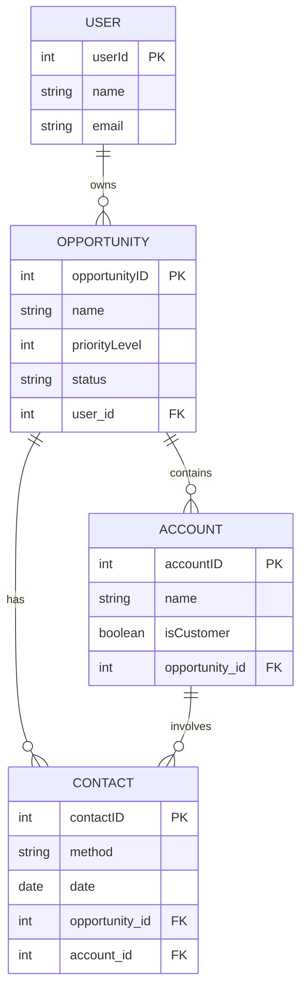

## Overview

Opportunities represent potential sales deals in the CRM system. They serve as the central hub connecting users, accounts, and contacts. Each opportunity tracks the deal's name, priority level, and current status, enabling comprehensive pipeline management.

## Data Model

### Opportunity Entity

```java
@Entity
@Table(name = "Opportunity")
public class Opportunity {
    @Id 
    @GeneratedValue(strategy = GenerationType.IDENTITY)
    private Integer opportunityID;
    
    private String name;
    private Integer priorityLevel;
    private String status;
    
    @ManyToOne(fetch = FetchType.LAZY, optional = false)
    @JoinColumn(name = "User_id", nullable = false)
    private User user;
    
    @OneToMany(mappedBy = "opportunity", fetch = FetchType.LAZY, cascade = CascadeType.ALL)
    private List<Account> accounts;
    
    @OneToMany(mappedBy = "opportunity", fetch = FetchType.LAZY, cascade = CascadeType.ALL)
    private List<Contact> contacts;
}
```

### Field Specifications

<CardGroup cols={2}>
  <Card title="opportunityID" icon="hashtag">
    **Type:** Integer (Auto-generated)
    
    Primary key, automatically generated using identity strategy
  </Card>
  
  <Card title="name" icon="tag">
    **Type:** String
    
    Descriptive name for the sales opportunity
    
    Example: "Q1 Enterprise Deal - Acme Corp"
  </Card>
  
  <Card title="priorityLevel" icon="arrow-up">
    **Type:** Integer
    
    Numeric priority ranking (e.g., 1=High, 2=Medium, 3=Low)
  </Card>
  
  <Card title="status" icon="circle-check">
    **Type:** String
    
    Current stage in the sales pipeline
    
    Common values: "New", "Qualified", "Proposal", "Negotiation", "Closed Won", "Closed Lost"
  </Card>
</CardGroup>

## Relationships

Opportunities are the central entity with multiple relationships:

<Tabs>
  <Tab title="User (Owner)">
    **Many-to-One (Required)**
    
    Each opportunity must be assigned to a user who owns/manages it.
    
    ```java
    @JsonIgnoreProperties({"hibernateLazyInitializer", "handler"})
    @ManyToOne(fetch = FetchType.LAZY, optional = false)
    @JoinColumn(name = "User_id", nullable = false)
    private User user;
    ```
    
    <Note>
      This identifies the sales representative responsible for the deal.
    </Note>
  </Tab>
  
  <Tab title="Accounts">
    **One-to-Many**
    
    An opportunity can involve multiple accounts.
    
    ```java
    @OneToMany(mappedBy = "opportunity", fetch = FetchType.LAZY, cascade = CascadeType.ALL)
    private List<Account> accounts;
    ```
    
    <Note type="info">
      Cascade operations ensure that when an opportunity is deleted, associated accounts are handled appropriately.
    </Note>
  </Tab>
  
  <Tab title="Contacts">
    **One-to-Many**
    
    All communication related to the opportunity is tracked through contacts.
    
    ```java
    @OneToMany(mappedBy = "opportunity", fetch = FetchType.LAZY, cascade = CascadeType.ALL)
    private List<Contact> contacts;
    ```
    
    <Note type="info">
      This provides a complete audit trail of all interactions for the deal.
    </Note>
  </Tab>
</Tabs>

## Entity Relationship Diagram



## API Endpoints

### Create Opportunity

Create a new sales opportunity.

```java
@PostMapping("/createOpportunity")
public ResponseEntity<Opportunity> createOpportunity(@Valid @RequestBody Opportunity opportunity)
```

<Accordion title="Request Details">
  **Endpoint:** `POST /api/opportunity/createOpportunity`
  
  **Request Body:**
  ```json
  {
    "name": "Q1 Enterprise Deal - Acme Corp",
    "priorityLevel": 1,
    "status": "Qualified",
    "user": {
      "userId": 1
    }
  }
  ```
  
  **Response:** Returns the created opportunity object with generated `opportunityID`
  
  **Status Codes:**
  - `201 CREATED` - Opportunity successfully created
  - `404 NOT FOUND` - Creation failed
  
  <Note type="warning">
    An opportunity must be assigned to an existing user. The user ID is required.
  </Note>
</Accordion>

### Get All Opportunities

Retrieve all opportunities in the system.

```java
@GetMapping("/getOpportunities")
public ResponseEntity<List<Opportunity>> returnsOpportunities()
```

<Accordion title="Request Details">
  **Endpoint:** `GET /api/opportunity/getOpportunities`
  
  **Response:** Returns array of all opportunity objects
  ```json
  [
    {
      "opportunityID": 1,
      "name": "Q1 Enterprise Deal - Acme Corp",
      "priorityLevel": 1,
      "status": "Qualified"
    },
    {
      "opportunityID": 2,
      "name": "Mid-Market Expansion - TechCo",
      "priorityLevel": 2,
      "status": "Proposal"
    }
  ]
  ```
  
  **Status Codes:**
  - `200 OK` - Opportunities retrieved successfully
  - `404 NOT FOUND` - No opportunities found
</Accordion>

### Update Opportunity

Modify an existing opportunity.

```java
@PutMapping("/updateOpportunity")
public ResponseEntity<Boolean> updateOpportunity(@RequestBody Opportunity opportunity)
```

<Accordion title="Request Details">
  **Endpoint:** `PUT /api/opportunity/updateOpportunity`
  
  **Request Body:**
  ```json
  {
    "opportunityID": 1,
    "name": "Q1 Enterprise Deal - Acme Corp",
    "priorityLevel": 1,
    "status": "Negotiation",
    "user": {
      "userId": 1
    }
  }
  ```
  
  **Response:** Returns boolean indicating success
  ```json
  true
  ```
  
  **Status Codes:**
  - `200 OK` - Opportunity updated successfully
  - `404 NOT FOUND` - Opportunity not found or update failed
  
  <Note>
    Common use case: Updating status as the deal progresses through pipeline stages.
  </Note>
</Accordion>

### Delete Opportunity

Remove an opportunity from the system.

```java
@DeleteMapping("/deleteOpportunity")
public ResponseEntity<Boolean> deleteOpportunity(@RequestBody Opportunity opportunity)
```

<Accordion title="Request Details">
  **Endpoint:** `DELETE /api/opportunity/deleteOpportunity`
  
  **Request Body:**
  ```json
  {
    "opportunityID": 1
  }
  ```
  
  **Response:** Returns boolean indicating success
  ```json
  true
  ```
  
  **Status Codes:**
  - `200 OK` - Opportunity deleted successfully
  - `404 NOT FOUND` - Opportunity not found or deletion failed
  
  <Note type="warning">
    Deleting an opportunity will cascade delete all associated accounts and contacts due to the `CascadeType.ALL` configuration.
  </Note>
</Accordion>

## Service Layer

The `OpportunityService` manages business logic:

```java
@Service
public class OpportunityService {
    @Autowired
    OpportunityRepo opportunityRepository;

    // Create new opportunity
    public Opportunity saveOpportunity(Opportunity opportunity) {
        return opportunityRepository.save(opportunity);
    }

    // Retrieve all opportunities
    public List<Opportunity> retrieveOpportunities() {
        return opportunityRepository.findAll();
    }

    // Update existing opportunity
    public Boolean updateOpportunity(Opportunity opportunity) {
        try {
            opportunityRepository.save(opportunity);
            return true;
        } catch (Exception e) {
            return false;
        }
    }

    // Delete opportunity
    public Boolean deleteOpportunity(Opportunity opportunity) {
        try {
            opportunityRepository.delete(opportunity);
            return true;
        } catch (Exception e) {
            return false;
        }
    }
}
```

## Pipeline Stages

Typical opportunity status progression:

<CardGroup cols={3}>
  <Card title="New" icon="plus">
    **Priority:** Any
    
    Initial opportunity creation
  </Card>
  
  <Card title="Qualified" icon="check">
    **Priority:** High/Medium
    
    Prospect meets criteria
  </Card>
  
  <Card title="Proposal" icon="file">
    **Priority:** High
    
    Formal proposal submitted
  </Card>
  
  <Card title="Negotiation" icon="handshake">
    **Priority:** High
    
    Terms being finalized
  </Card>
  
  <Card title="Closed Won" icon="trophy">
    **Priority:** N/A
    
    Deal successfully closed
  </Card>
  
  <Card title="Closed Lost" icon="xmark">
    **Priority:** N/A
    
    Deal not won
  </Card>
</CardGroup>

## Priority Levels

<Tabs>
  <Tab title="High Priority (1)">
    **Characteristics:**
    - Large deal value
    - Strategic importance
    - Near-term close date
    - High probability of success
    
    **Action:** Daily attention and updates
  </Tab>
  
  <Tab title="Medium Priority (2)">
    **Characteristics:**
    - Standard deal size
    - Regular sales cycle
    - Moderate probability
    
    **Action:** Weekly check-ins
  </Tab>
  
  <Tab title="Low Priority (3)">
    **Characteristics:**
    - Small deal value
    - Long sales cycle
    - Lower probability
    
    **Action:** Periodic follow-up
  </Tab>
</Tabs>

## Frontend Integration

### Creating an Opportunity

```javascript
async function createOpportunity(opportunityData) {
  const requestOptions = {
    method: "POST",
    headers: { "Content-Type": "application/json" },
    body: JSON.stringify({
      name: opportunityData.name,
      priorityLevel: opportunityData.priority,
      status: opportunityData.status,
      user: {
        userId: opportunityData.userId
      }
    }),
  };

  try {
    const response = await fetch(
      "http://localhost:8080/api/opportunity/createOpportunity",
      requestOptions
    );
    
    if (response.ok) {
      const opportunity = await response.json();
      console.log("Opportunity created:", opportunity);
      return opportunity;
    }
  } catch (error) {
    console.error("Error creating opportunity:", error);
  }
}
```

### Updating Opportunity Status

```javascript
async function updateOpportunityStatus(opportunityId, newStatus) {
  // First, get the current opportunity
  const currentOpportunity = await getOpportunityById(opportunityId);
  
  const requestOptions = {
    method: "PUT",
    headers: { "Content-Type": "application/json" },
    body: JSON.stringify({
      ...currentOpportunity,
      status: newStatus
    }),
  };

  try {
    const response = await fetch(
      "http://localhost:8080/api/opportunity/updateOpportunity",
      requestOptions
    );
    
    if (response.ok) {
      return await response.json();
    }
  } catch (error) {
    console.error("Error updating opportunity:", error);
  }
}
```

### Deleting an Opportunity

```javascript
async function deleteOpportunity(opportunityId) {
  const requestOptions = {
    method: "DELETE",
    headers: { "Content-Type": "application/json" },
    body: JSON.stringify({
      opportunityID: opportunityId
    }),
  };

  try {
    const response = await fetch(
      "http://localhost:8080/api/opportunity/deleteOpportunity",
      requestOptions
    );
    
    if (response.ok) {
      const success = await response.json();
      console.log("Opportunity deleted:", success);
      return success;
    }
  } catch (error) {
    console.error("Error deleting opportunity:", error);
  }
}
```

## Best Practices

<CardGroup cols={2}>
  <Card title="Descriptive Names" icon="tag">
    Use clear, informative names that include account and timeframe
  </Card>
  
  <Card title="Priority Management" icon="arrow-up">
    Regularly review and adjust priority levels based on deal progress
  </Card>
  
  <Card title="Status Updates" icon="rotate">
    Keep status current to maintain accurate pipeline visibility
  </Card>
  
  <Card title="Owner Assignment" icon="user">
    Always assign opportunities to active users for accountability
  </Card>
</CardGroup>

## Common Workflows

### New Deal Flow

1. **Create Opportunity** - User creates new opportunity with initial status "New"
2. **Add Accounts** - Associate relevant accounts with the opportunity
3. **Log Contacts** - Track all interactions through contact records
4. **Update Status** - Progress through pipeline stages as deal advances
5. **Close Deal** - Update to "Closed Won" or "Closed Lost"

### Pipeline Review

```javascript
// Get all opportunities grouped by status
const opportunities = await getAllOpportunities();
const pipeline = opportunities.reduce((acc, opp) => {
  const status = opp.status;
  if (!acc[status]) acc[status] = [];
  acc[status].push(opp);
  return acc;
}, {});

console.log("Pipeline Overview:", pipeline);
```

## Cascade Behavior

<Note type="warning">
  **Important:** The `CascadeType.ALL` configuration means:
  
  - Deleting an opportunity will delete all associated accounts
  - Deleting an opportunity will delete all associated contacts
  - This provides data integrity but requires careful consideration before deletion
</Note>

## Performance Considerations

<Note type="info">
  All relationships use `FetchType.LAZY` for performance optimization. Related entities are only loaded when explicitly accessed, reducing unnecessary database queries.
</Note>

```java
// Relationships are not loaded until accessed
Opportunity opp = opportunityRepo.findById(1);

// This triggers a query to load accounts
List<Account> accounts = opp.getAccounts();

// This triggers a query to load contacts
List<Contact> contacts = opp.getContacts();
```

## Related Resources

- [Accounts](/features/accounts) - Learn about opportunity-account relationships
- [Contacts](/features/contacts) - Track opportunity communications
- [Users & Authentication](/features/users-authentication) - Understand opportunity ownership
